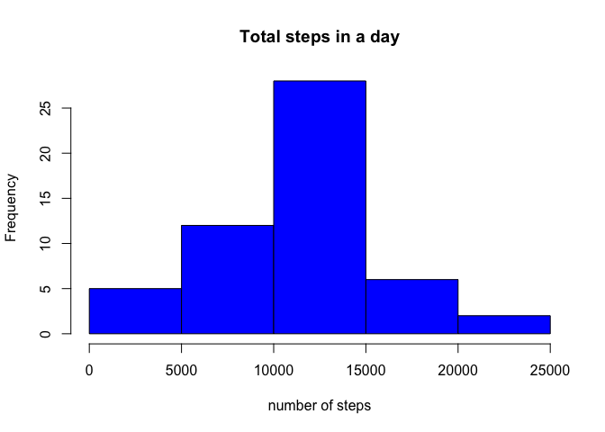
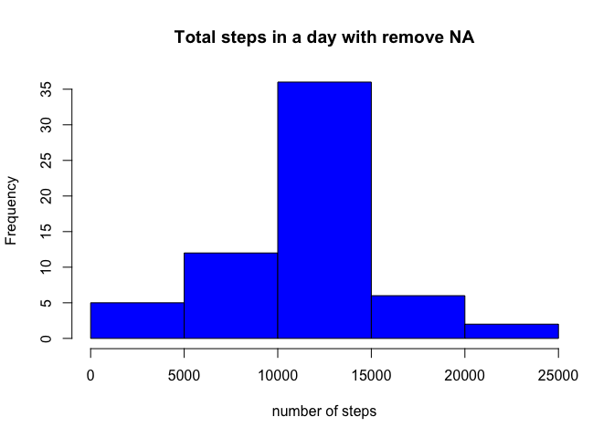
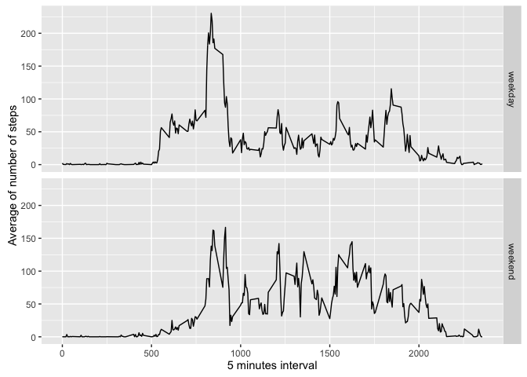

---
title: "Peer-graded Assignment: Course Project 1"


```r
library(knitr)
library(plyr)  
library(ggplot2) 
opts_chunk$set(dev="png", fig.path="figure/")
```
#Loading and preprocessing the data
Load the data and show the first 6 rows of the data


```r
activity<-read.csv("activity.csv")
head(activity)
```

```
##   steps       date interval
## 1    NA 2012-10-01        0
## 2    NA 2012-10-01        5
## 3    NA 2012-10-01       10
## 4    NA 2012-10-01       15
## 5    NA 2012-10-01       20
## 6    NA 2012-10-01       25
```

#What is mean total number of steps taken per day?
Ignoring the missing values in the dataset, here's the first 6 rows of total number of steps taken per day.


```r
day_step<-aggregate(steps~date,activity,sum)
head(day_step)
```

```
##         date steps
## 1 2012-10-02   126
## 2 2012-10-03 11352
## 3 2012-10-04 12116
## 4 2012-10-05 13294
## 5 2012-10-06 15420
## 6 2012-10-07 11015
```

Histogram of the total number of steps taken each day


```r
hist(day_step$steps,main="Total steps in a day", col="blue",xlab="number of steps")
```

<!-- -->


```r
m1<-mean(day_step$steps)
med1<-median(day_step$steps)
```

The mean is 1.0766189\times 10^{4} and the median is 10765.

#What is the average daily activity pattern?
Plot of the 5-minute interval (x-axis) and the average number of steps taken, averaged across all days (y-axis)


```r
interval_step<-aggregate(steps~interval,activity,mean)
plot(interval_step$interval,interval_step$steps, type="l", xlab="Interval", ylab="Number of Steps",main="Average Number of Steps per Day by Interval")
```

<!-- -->


```r
interval_max <- interval_step[which.max(interval_step$steps),1]
```
On average across all the days in the dataset, interval 835 contains the maximum number of steps


#Imputing missing values


```r
s1<-sum(is.na(activity$steps))
```
The total number of missing values in the dataset is 2304.
Some sample of data with missing values:

```r
head(activity)
```

```
##   steps       date interval
## 1    NA 2012-10-01        0
## 2    NA 2012-10-01        5
## 3    NA 2012-10-01       10
## 4    NA 2012-10-01       15
## 5    NA 2012-10-01       20
## 6    NA 2012-10-01       25
```

Imputing the missing values with the mean of the relavant interval, here's a few rows of data with filled data

```r
interval_mean<-aggregate(steps~interval,activity,mean,na.rm=TRUE);
merge_data<-merge(activity,interval_mean,by="interval");
merge_data$steps.x[is.na(merge_data$steps.x)] <- merge_data$steps.y[is.na(merge_data$steps.x)];
merge_data<-merge_data[ ,1:3];
head(merge_data)
```

```
##   interval  steps.x       date
## 1        0 1.716981 2012-10-01
## 2        0 0.000000 2012-11-23
## 3        0 0.000000 2012-10-28
## 4        0 0.000000 2012-11-06
## 5        0 0.000000 2012-11-24
## 6        0 0.000000 2012-11-15
```

```r
s<-sum(is.na(merge_data$steps.x))
```
The number of missing values of the filled data become 0.

Histogram of the total number of steps taken each day with filled data

```r
day_merge_data<-aggregate(steps.x~date,merge_data,sum)
hist(day_merge_data$steps.x,main="Total steps in a day with remove NA", col="blue",xlab="number of steps")
```

<!-- -->

```r
m2 <- mean(day_merge_data$steps.x)
med2<-median(day_merge_data$steps.x)
```
The mean of the imputed data is 1.0766189\times 10^{4} and median is 1.0766189\times 10^{4}. The mean is same as the first part but the median is higher than the first part.

#Are there differences in activity patterns between weekdays and weekends?
Creating new factor variable in the dataset with two levels - "weekday" and "weekend" indicating whether a given date is a weekday or weekend day.


```r
merge_data$date<-as.Date(merge_data$date, format = "%Y-%m-%d")
weekday<-weekdays(merge_data$date)
merge_data<-cbind(merge_data,weekday)
merge_data<- transform(merge_data, weekday = ifelse(weekday == "Saturday"|weekday == "Sunday", "weekend", "weekday"))
```

Some examples of the data with new variable:

```r
head(merge_data)
```

```
##   interval  steps.x       date weekday
## 1        0 1.716981 2012-10-01 weekday
## 2        0 0.000000 2012-11-23 weekday
## 3        0 0.000000 2012-10-28 weekend
## 4        0 0.000000 2012-11-06 weekday
## 5        0 0.000000 2012-11-24 weekend
## 6        0 0.000000 2012-11-15 weekday
```

Plot of the 5-minute interval (x-axis) and the average number of steps taken, averaged across all weekday days or weekend days (y-axis). 


```r
average<-aggregate(steps.x ~ interval + weekday, merge_data, mean)
library(ggplot2)
ggplot(average, aes(interval, steps.x)) + geom_line() + facet_grid(weekday ~ .) + xlab("5 minutes interval") + ylab("Average of number of steps")
```

<!-- -->
